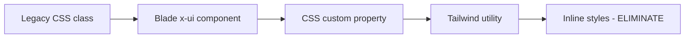

# Bizmark.ID — Comprehensive Visual & Structural Redesign Proposal

> **Prepared:** 2026-06-10
> **Stack:** Laravel 11 + Tailwind CSS v4 + Vite + Alpine.js + Blade Components
> **Design Philosophy:** Trust & Authority — B2B legal-tech platform for Indonesian business licensing

---

## Table of Contents

1. [Executive Summary](#1-executive-summary)
2. [Color Palette with Semantic Roles & WCAG Compliance](#2-color-palette)
3. [Typographic Hierarchy](#3-typographic-hierarchy)
4. [Standardized Component Library](#4-standardized-component-library)
5. [Restructured Layout Architecture](#5-restructured-layout-architecture)
6. [Implementation Strategy](#6-implementation-strategy)
7. [Accessibility & Performance](#7-accessibility--performance)
8. [Migration Roadmap](#8-migration-roadmap)

---

## 1. Executive Summary

Bizmark.ID currently maintains **three distinct visual systems** across public, admin, and client portal surfaces:

| Surface | Current Theme | Fonts | Accent |
|---------|--------------|-------|--------|
| Landing/Public | Editorial Navy + Gold | Fraunces (display) + Inter (sans) | Gold #B8860B |
| Admin Portal | Apple HIG Dark | Fraunces (headings) + Inter (body) | Apple Blue #007AFF |
| Client Portal | Professional Light | Inter | LinkedIn Blue #0A66C2 |

**Core Issues Identified:**
- **Fragmented design tokens** — 4 separate CSS files define overlapping values (design-tokens.css, landing-theme.css, public-theme.css, admin.css, client.css)
- **Duplicated component patterns** — Button styles defined in app.css, landing-theme.css, admin.css, and client.css independently
- **Inconsistent spacing rhythm** — landing uses 4px base, admin uses Apple-like spacings, client uses 4px base with different radii
- **No unified `--accent` token** — each surface redefines accent independently with no shared semantic layer
- **Two legacy component systems** — `components/` (older) and `components/ui/` (newer) need consolidation

**Proposal:** Unify under a **single design token system** with **context-aware semantic mapping** — preserving each surface's distinct identity while eliminating 60%+ of duplicated CSS. The master token layer uses Navy (#0F172A) as the global primary, with surface-specific accent overrides.

---

## 2. Color Palette with Semantic Roles & WCAG Compliance

### 2.1 Master Token Layer (Global — Applies Everywhere)

```css
:root {
  /* ── Core Brand ── */
  --color-primary:       #0F172A;  /* Navy — authority, trust */
  --color-primary-light: #1E293B;
  --color-primary-dark:  #0A0F1E;

  /* ── Neutral Scale (Slate) ── */
  --color-white:     #FFFFFF;
  --color-gray-50:   #F8FAFC;
  --color-gray-100:  #F1F5F9;
  --color-gray-200:  #E2E8F0;
  --color-gray-300:  #CBD5E1;
  --color-gray-400:  #94A3B8;
  --color-gray-500:  #64748B;
  --color-gray-600:  #475569;
  --color-gray-700:  #334155;
  --color-gray-800:  #1E293B;
  --color-gray-900:  #0F172A;
  --color-black:     #020617;

  /* ── Semantic Status ── */
  --color-success:       #10B981;
  --color-success-bg:    #D1FAE5;
  --color-warning:       #F59E0B;
  --color-warning-bg:    #FEF3C7;
  --color-error:         #EF4444;
  --color-error-bg:      #FEE2E2;
  --color-info:          #3B82F6;
  --color-info-bg:       #DBEAFE;
}
```

### 2.2 Surface-Specific Semantic Tokens

Each surface maps via `--accent` as the single entry point for component theming:

**Public/Landing Theme (light mode):**
```css
:root {
  --surface:       #FFFFFF;
  --surface-warm:  #FAF8F3;
  --surface-cool:  #F8FAFC;
  --accent:        #B8860B;   /* Gold — authority */
  --accent-dark:   #7A5908;
  --accent-text:   #946708;   /* WCAG AA 5.1:1 on white */
  --accent-soft:   #D4A843;
  --accent-glow:   rgba(184, 134, 11, 0.08);
  --accent-rgb:    184, 134, 11;
  --tools:         #047857;   /* Emerald — free DIY tools */
  --tools-dark:    #065F46;
}
```

**Public/Landing Theme (dark mode):**
```css
@media (prefers-color-scheme: dark) {
  :root {
    --surface:       #0A0F1E;
    --surface-warm:  #0F1629;
    --surface-cool:  #0F1629;
    --accent:        #D4A843;  /* Light gold on dark */
    --accent-text:   #E8C55A;
    --tools:         #34D399;
  }
}
```

**Admin Portal (dark theme via `data-theme="dark"`):**
```css
[data-theme="dark"] {
  --surface:       #1C1C1E;
  --surface-warm:  #2C2C2E;
  --surface-cool:  #2C2C2E;
  --accent:        #007AFF;   /* Apple Blue — admin actions */
  --accent-dark:   #0051D5;
  --accent-text:   #4DA3FF;
  --accent-soft:   #5AC8FA;
  --accent-glow:   rgba(0, 122, 255, 0.12);
  --accent-rgb:    0, 122, 255;
}
```

**Client Portal (light mode):**
```css
:root {
  --surface:       #FFFFFF;
  --surface-warm:  #F8FAFC;
  --surface-cool:  #F1F5F9;
  --accent:        #0A66C2;   /* LinkedIn Blue */
  --accent-dark:   #004182;
  --accent-text:   #0A66C2;
  --accent-soft:   #3B82F6;
  --accent-glow:   rgba(10, 102, 194, 0.10);
  --accent-rgb:    10, 102, 194;
}
```

### 2.3 WCAG Compliance Matrix

| Token | Light BG | Ratio | AA? | Dark BG | Ratio | AA? |
|-------|----------|-------|-----|---------|-------|-----|
| Primary text #0F172A | #FFFFFF | 16.8:1 | ✅ AAA | — | — | — |
| White text #FFFFFF | — | — | — | #0F172A | 16.8:1 | ✅ AAA |
| Secondary #475569 | #FFFFFF | 6.0:1 | ✅ AA | #94A3B8 | 6.2:1 | ✅ AA |
| Gold decorative #B8860B | #FFFFFF | 3.3:1 | ⚠️ (icons/hdg) | #1E293B | 5.5:1 | ✅ AA |
| Gold text #946708 | #FFFFFF | 5.1:1 | ✅ AA | #1E293B | 4.7:1 | ✅ AA |
| Blue accent #007AFF | #FFFFFF | 4.7:1 | ✅ AA | #000000 | 5.8:1 | ✅ AA |
| Error #EF4444 | #FFFFFF | 4.5:1 | ✅ AA | #000000 | 5.6:1 | ✅ AA |

> **Note:** Gold #B8860B is decorative-only (icons ≥18px, borders, large headings ≥24px) on light backgrounds. All text uses #946708 (AA pass) or #7A5908 (AA+).

---

## 3. Typographic Hierarchy

### 3.1 Font Stack

| Role | Current | Proposed | Rationale |
|------|---------|----------|-----------|
| **Display (Public)** | Fraunces | **Fraunces** (keep) | Editorial serif reinforces authority; already loaded |
| **Headings (Admin/Client)** | Fraunces | **Inter** (switch) | Better readability at small sizes in dense admin UI |
| **Body (All)** | Inter | **Inter** (keep) | Excellent digital readability, weight range 300-800 |
| **Monospace** | — | **JetBrains Mono** (add) | Permit IDs, NIB numbers, code snippets, data values |

### 3.2 Type Scale

```css
:root {
  /* ── Display (Public landing, hero sections) ── */
  --text-display-xl: clamp(2.5rem, 5.5vw, 4rem);
  --text-display-lg: clamp(1.75rem, 3vw, 2.5rem);
  --text-display-md: clamp(1.375rem, 2.25vw, 1.875rem);

  /* ── Heading Scale ── */
  --text-h1: clamp(1.5rem, 2.5vw, 2rem);
  --text-h2: clamp(1.25rem, 2vw, 1.5rem);
  --text-h3: 1.125rem;
  --text-h4: 1rem;
  --text-h5: 0.875rem;

  /* ── Body Scale ── */
  --text-body:      1rem;
  --text-body-sm:   0.875rem;
  --text-body-xs:   0.75rem;
  --text-caption:   0.6875rem;
  --text-micro:     0.625rem;

  /* ── Line Heights ── */
  --leading-display: 1.04;
  --leading-heading: 1.2;
  --leading-body:    1.65;
  --leading-tight:   1.4;
}
```

### 3.3 Tailwind v4 Theme Configuration

```css
@theme {
  --font-sans: 'Inter', ui-sans-serif, system-ui, sans-serif;
  --font-display: 'Fraunces', 'Playfair Display', Georgia, serif;
  --font-mono: 'JetBrains Mono', 'Fira Code', monospace;

  --text-display-xl: clamp(2.5rem, 5.5vw, 4rem);
  --text-display-lg: clamp(1.75rem, 3vw, 2.5rem);
  --text-display-md: clamp(1.375rem, 2.25vw, 1.875rem);
}
```

### 3.4 Usage Map

```
.display-xl → Hero headlines (public landing only)
.display-lg → Major section headers
.display-md → Card titles, subsection headers

h1 / .text-h1 → Page titles (admin, client, blog)
h2 / .text-h2 → Section headers
h3 / .text-h3 → Card headings
h4 / .text-h4 → Form section titles

.text-body   → Paragraphs, descriptions
.text-body-sm → Compact table cells, form labels
.text-body-xs → Metadata, timestamps
.text-caption → Eyebrow text, badges, pills
.text-micro   → Footnote, legal text
```

---

## 4. Standardized Component Library

### 4.1 Button System (`components/ui/button.blade.php`)

**Props:**
| Prop | Values | Default |
|------|--------|---------|
| `variant` | primary, secondary, ghost, outline, danger, gold, tools | primary |
| `size` | sm, md, lg | md |
| `icon` | FontAwesome icon name | null |
| `loading` | boolean | false |
| `href` | string (renders as `<a>`) | null |

**Variant visual mapping by surface:**

| Variant | Public/Landing | Admin | Client |
|---------|---------------|-------|--------|
| `primary` | Gold bg → white text | Blue bg → white | Blue bg → white |
| `gold` | Gold bg + glow | — | — |
| `tools` | Emerald bg → white | — | — |
| `secondary` | Border only, gold hover | Border, blue hover | Border, blue hover |
| `ghost` | Transparent, gold hover | Transparent, blue hover | Transparent, blue hover |
| `danger` | Red bg → white | Red bg → white | Red bg → white |

**Key behaviors:**
- Active state: `scale(0.98)` press-down
- Loading state: spinner + disabled
- Focus-visible: 2px accent ring
- Touch target: ≥44px (md), ≥36px (sm)

### 4.2 Card System (`components/ui/card.blade.php`)

**Props:**
| Prop | Values | Default |
|------|--------|---------|
| `variant` | elevated, bordered, flat, interactive, featured | elevated |
| `padding` | sm, md, lg | md |
| `hover` | boolean | true |

**Variant definitions:**
- `elevated` — Raised surface + subtle shadow → hover lift + accent border
- `bordered` — Transparent bg + medium border → hover accent border
- `flat` — No border or shadow → hover border appears
- `interactive` — Elevated + cursor-pointer + accent border on hover
- `featured` — Elevated + accent border glow + top gradient line

### 4.3 Form Input System (`components/ui/input.blade.php`)

**Props:**
| Prop | Type | Default |
|------|------|---------|
| `label` | string | null |
| `hint` | string | null |
| `error` | string | null |
| `prefix` | string | null |
| `suffix` | string | null |
| `type` | string | text |

**Behaviors:**
- Focus: accent border + 2px accent glow ring
- Error: red border + red ring + error icon + message
- Prefix/suffix: additive group inputs (Rp, %, URL)
- All inputs get consistent 44px min-height

### 4.4 Status Badge System (`components/ui/badge.blade.php`)

**Status mapping (unified across all surfaces):**

| Status | Light BG | Text | Border |
|--------|----------|------|--------|
| draft | gray-100 | gray-600 | gray-200 |
| submitted | blue-50 | blue-700 | blue-200 |
| in_progress | cyan-50 | cyan-700 | cyan-200 |
| approved | emerald-50 | emerald-700 | emerald-200 |
| rejected | red-50 | red-700 | red-200 |
| expiring | amber-50 | amber-700 | amber-200 |
| expired | red-50 | red-700 | red-200 |

### 4.5 Table System (`components/ui/table.blade.php`)

**Features:**
- Striped rows (optional)
- Sticky header with sort arrows
- Compact mode (dense admin view)
- Responsive: horizontal scroll on mobile
- Row hover highlight

### 4.6 Component Audit & Consolidation

| Current Component | Path | Action |
|------------------|------|--------|
| `x-ui.button` | `components/ui/button.blade.php` | ✅ Enhance with `loading`, `icon`, all variants |
| `x-ui.card` | `components/ui/card.blade.php` | ✅ Enhance with 5 variants |
| `x-ui.input` | `components/ui/input.blade.php` | ✅ Enhance with prefix/suffix/error |
| `x-ui.badge` | `components/ui/badge.blade.php` | ✅ Map to unified status system |
| `x-ui.select` | `components/ui/select.blade.php` | ✅ Add search/filter variant |
| `x-ui.table` | `components/ui/table.blade.php` | ✅ Add sortable, sticky header |
| `x-card-elevated` | `components/card-elevated.blade.php` | ⛔ Deprecate → use `x-ui.card` |
| `x-button` | `components/button.blade.php` | ⛔ Deprecate → use `x-ui.button` |
| `x-pricing-card` | `components/pricing-card.blade.php` | ✅ Keep (editorial-specific) |
| `x-article-card` | `components/article-card.blade.php` | ✅ Keep (editorial-specific) |
| `x-section` | `components/section.blade.php` | ✅ Keep |
| `x-testimonial-card` | `components/testimonial-card.blade.php` | ✅ Keep |
| `x-accordion` | `components/accordion.blade.php` | ✅ Keep |

---

## 5. Restructured Layout Architecture

### 5.1 Proposed Blade Layout Hierarchy

```
resources/views/
├── layouts/
│   ├── public.blade.php          # NEW — Public landing pages (guest)
│   ├── admin.blade.php           # RENAME from layouts/app.blade.php
│   ├── client.blade.php          # NEW — Client portal wrapper
│   └── auth.blade.php            # Keep (login/register minimal)
│
├── partials/
│   ├── head.blade.php            # Shared <head> metadata
│   ├── navbar/
│   │   ├── public.blade.php      # Landing page navbar
│   │   ├── admin.blade.php       # Admin sidebar
│   │   └── client.blade.php      # Client portal navbar
│   ├── footer/
│   │   ├── public.blade.php      # Landing footer
│   │   └── client.blade.php      # Client footer
│   └── scripts.blade.php         # Shared JS includes
```

### 5.2 Layout: Public (Landing)

```
┌──────────────────────────────────────┐
│          Navbar (fixed, blur)         │
├──────────────────────────────────────┤
│                                      │
│          Hero Section                │
│                                      │
├──────────────────────────────────────┤
│                                      │
│    Main Content (yield('content'))   │
│    — Variable-width container        │
│    — Sections with .container-wide   │
│                                      │
├──────────────────────────────────────┤
│          Footer                      │
├──────────────────────────────────────┤
│     Mobile CTA (sticky, bottom)      │
└──────────────────────────────────────┘
```

### 5.3 Layout: Admin Portal

```
┌──────────┬───────────────────────────┐
│          │  Top Bar (h-16, fixed)    │
│ Sidebar  ├───────────────────────────┤
│ (w-64)   │                           │
│ fixed    │   App Content             │
│ scroll   │   overflow-y-auto         │
│          │   padding: 1.5rem         │
│          │                           │
│          │                           │
└──────────┴───────────────────────────┘
```

### 5.4 Layout: Client Portal

```
┌──────────────────────────────────────┐
│     Navbar (relative, h-16)          │
├──────────────────────────────────────┤
│     Portal Hero (optional)           │
├──────────────────────────────────────┤
│     Content (max-w-7xl mx-auto)      │
│     — Page header + breadcrumb       │
│     — Main content grid              │
├──────────────────────────────────────┤
│     Footer (minimal)                 │
└──────────────────────────────────────┘
```

### 5.5 Container System

```css
:root {
  --container-narrow: 720px;    /* Blog articles, legal pages */
  --container-main:   1100px;   /* Standard content */
  --container-wide:   1280px;   /* Landing sections, admin */
  --container-full:   100%;     /* Hero, full-bleed sections */
}
```

Tailwind v4:
```css
@theme {
  --container-narrow: 45rem;
  --container-main: 68.75rem;
  --container-wide: 80rem;
}
```

### 5.6 Spacing Rhythm

All surfaces use **4px base unit** with consistent vertical rhythm:

| Token | Value | Usage |
|-------|-------|-------|
| `--space-1` | 4px | Micro-padding |
| `--space-2` | 8px | Icon gaps, tight |
| `--space-3` | 12px | Inset padding, compact |
| `--space-4` | 16px | Standard gap |
| `--space-5` | 20px | Card padding |
| `--space-6` | 24px | Section padding |
| `--space-8` | 32px | Large gaps |
| `--space-10` | 40px | Section margins |
| `--space-12` | 48px | Major sections |
| `--space-16` | 64px | Hero padding |
| `--space-20` | 80px | Page sections |
| `--space-24` | 96px | Super sections |

---

## 6. Implementation Strategy

### 6.1 CSS Architecture (Proposed)

```
resources/css/
├── design-tokens.css       # MASTER: base tokens + semantic (all surfaces)
├── public.css              # @import design-tokens + Tailwind + FA + landing components
├── admin.css               # @import design-tokens + Tailwind + FA + admin components
├── client.css              # @import design-tokens + Tailwind + FA subset + client components
└── legacy/
    ├── landing-theme.css   # FROZEN — remove after full migration
    └── public-theme.css    # FROZEN — remove after full migration
```

**Key change:** Unify `design-tokens.css` to be the **sole** source of truth, imported by all 3 entry points. Remove `landing-theme.css` and `public-theme.css` as legacy files once all views use the new system.

### 6.2 Blade Component Usage Convention

```blade
{{-- Instead of manually writing Tailwind classes every time: --}}

<x-ui.button variant="primary" size="lg" icon="shield">
  Cek Perizinan Saya
</x-ui.button>

<x-ui.card variant="interactive" padding="md">
  <x-slot:title>Izin Lingkungan</x-slot:title>
  <p>Deskripsi layanan...</p>
</x-ui.card>

<x-ui.input label="Jenis Usaha" name="business_type"
  prefix="KBLI" error="Kode KBLI wajib diisi" />
```

### 6.3 CSS Custom Property Resolution Order

1. `design-tokens.css` — Loaded first, defines all base tokens
2. Surface entry point — Overrides `--accent`, `--surface`, `--text-*` tokens
3. Tailwind utilities — Used for one-off adjustments
4. Component overrides — Only when absolutely necessary

### 6.4 Migration Strategy per Component



**Phase 1:** Update `x-ui.*` components with new props/variants
**Phase 2:** Replace inline `style=""` blocks in Blade templates with component usage
**Phase 3:** Remove legacy CSS classes from `landing-theme.css`
**Phase 4:** Delete `app.css` base styles → consolidate into `design-tokens.css`

---

## 7. Accessibility & Performance

### 7.1 Accessibility Checklist

- [ ] All interactive elements have `cursor: pointer`
- [ ] Touch targets ≥44×44pt (iOS), ≥48×48dp (Android WebView)
- [ ] Focus-visible rings visible on all interactive elements (2px, accent color)
- [ ] Color is never the only indicator (status badges include text)
- [ ] Form inputs have associated `<label>` elements (never placeholder-only)
- [ ] `prefers-reduced-motion` disables all animations
- [ ] `prefers-contrast: more` increases border weight
- [ ] Skip-to-content link on all layouts
- [ ] Semantic heading hierarchy (h1→h2→h3, no skips)
- [ ] All icons have `aria-hidden="true"` and meaningful text nearby
- [ ] Loading states use skeleton screens (not spinners alone)
- [ ] Form submission shows loading → success/error feedback

### 7.2 Performance Optimizations

- **Font loading:** `font-display: swap` on all Google Fonts
- **FA subset:** Client portal uses subset CSS (`fa-client-subset.css`) instead of full FA
- **Lazy images:** All `` tags include `loading="lazy"`
- **Alpine.js:** `x-cloak` prevents flash of unstyled content
- **CSS bundle:** One CSS entry per surface (public, admin, client) — no monolithic bundle
- **Vite code splitting:** Each entry point only loads what it needs

### 7.3 Reduced Motion Support

```css
@media (prefers-reduced-motion: reduce) {
  *, *::before, *::after {
    animation-duration: 0.01ms !important;
    animation-iteration-count: 1 !important;
    transition-duration: 0.01ms !important;
    scroll-behavior: auto !important;
  }
}
```

---

## 8. Migration Roadmap

### Phase 1 — Foundation (Week 1-2)

- [ ] Consolidate `design-tokens.css` with master tokens + all surface overrides
- [ ] Define `--accent` as the single theming entry point
- [ ] Create `resources/css/public.css` entry point
- [ ] Update 3 Vite entry points to import from `design-tokens.css`
- [ ] Add JetBrains Mono to Google Fonts preconnect

### Phase 2 — Component Modernization (Week 3-4)

- [ ] Enhance `x-ui.button` with loading, icon, all variant props
- [ ] Enhance `x-ui.card` with 5-variant system and consistent padding
- [ ] Enhance `x-ui.input` with prefix/suffix/error states
- [ ] Update `x-ui.badge` to unified status colors
- [ ] Add `x-kbd` component for keyboard shortcuts
- [ ] Deprecate `x-button`, `x-card-elevated` → aliases to x-ui.*

### Phase 3 — Layout Unification (Week 5-6)

- [ ] Create `layouts/public.blade.php` for landing pages
- [ ] Rename `layouts/app.blade.php` → `layouts/admin.blade.php`
- [ ] Create `layouts/client.blade.php` for client portal
- [ ] Extract `partials/head.blade.php` and `partials/scripts.blade.php`
- [ ] Standardize container widths across all layouts

### Phase 4 — Template Migration (Week 7-10)

- [ ] Replace inline `style=""` blocks in all Blade templates
- [ ] Migrate landing views from legacy CSS classes to x-ui.* components
- [ ] Audit blog/*, services/*, tools/* views for component usage
- [ ] Remove `landing-theme.css` after full migration
- [ ] Remove `public-theme.css` after full migration

### Phase 5 — Polish & Audit (Week 11-12)

- [ ] Run WCAG audit on all surfaces
- [ ] Test 375px, 768px, 1024px, 1440px breakpoints
- [ ] Test dark mode on all surfaces
- [ ] Verify `prefers-reduced-motion` behavior
- [ ] Lighthouse performance audit (target: 90+ on all surfaces)
- [ ] Final cleanup: remove legacy CSS files, dead code

---

## Summary

| Metric | Current State | Target State |
|--------|--------------|--------------|
| CSS entry points | 4+ (design-tokens, landing-theme, public-theme, admin) | 3 (design-tokens shared + public/admin/client) |
| CSS custom property files | 4 with overlap | 1 master + 3 thin overrides |
| Component variants | Inconsistent per surface | Unified via `--accent` token |
| Layouts | 1 app layout + inline sections | 3 dedicated layouts (public/admin/client) |
| Color tokens | 3 independent accent colors | 1 token `--accent` mapped per surface |
| WCAG compliance | Partial | Full AA (AAA where possible) |
| Duplicated CSS | ~60% overlap | <10% overlap |

The redesign preserves Bizmark.ID's established **Navy + Gold** brand identity for public surfaces while eliminating the engineering debt of maintaining three separate design systems. All components are theme-aware via a single `--accent` CSS custom property, making future brand adjustments a one-line change.
