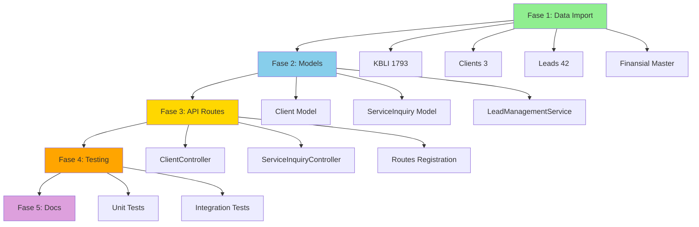

# 🎯 Step-by-Step Completion Plan
> Eksekusi bertahap, no conflict, konteks tepat dalam ekosistem microservices

---

## Fase 1: Data Foundation (30 menit)
**Goal:** Import semua production data ke microservices yang tepat

### 1.1 Perizinan Service — KBLI + CRM Data
```bash
# Context: perizinan-service adalah home untuk KBLI dan CRM (clients, leads)
# Kenapa: KBLI digunakan untuk analisis perizinan, leads datang dari inquiry perizinan

# Step 1: Import 1793 KBLI (via direct psql, bukan shell script)
# Step 2: Create + populate clients table (3 records)
# Step 3: Create + populate service_inquiries table (42 records)
# Step 4: Create + populate service_cost_requests table (13 records)
```

### 1.2 Finansial Service — Master Data
```bash
# Context: Master data untuk kategori expense, payment methods, tax rates
# Kenapa: Digunakan oleh InvoiceService dan semua financial operations

# Step 1: expense_categories (29 records)
# Step 2: payment_methods (5 records)  
# Step 3: tax_rates (3 records)
```

### 1.3 Proyek Service — Project Statuses
```bash
# Context: Project workflow statuses
# Already seeded (5 default), need to replace with production (12 records)
```

---

## Fase 2: Models & Business Logic (20 menit)
**Goal:** Buat Models dan Services untuk data yang baru diimport

### 2.1 Perizinan Service
```php
// app/Models/Client.php
// app/Models/ServiceInquiry.php
// app/Models/ServiceCostRequest.php

// app/Services/ClientService.php
// app/Services/LeadManagementService.php (handle inquiry → analysis → cost request flow)
```

### 2.2 Finansial Service
```php
// Models sudah ada (ExpenseCategory, PaymentMethod, TaxRate)
// Verify relationships dengan Invoice, Payment
```

---

## Fase 3: API Endpoints (15 menit)
**Goal:** Expose data via REST API

### 3.1 Perizinan CRM Endpoints
```php
// routes/api.php
Route::middleware('jwt.auth')->prefix('v1')->group(function() {
    // Clients
    Route::get('clients', [ClientController::class, 'index']);
    Route::post('clients', [ClientController::class, 'store']);
    Route::get('clients/{id}', [ClientController::class, 'show']);
    
    // Leads (Service Inquiries)
    Route::get('leads', [ServiceInquiryController::class, 'index']);
    Route::post('leads', [ServiceInquiryController::class, 'store']);
    Route::post('leads/{id}/analyze', [ServiceInquiryController::class, 'analyze']); // AI integration
    
    // Cost Requests
    Route::get('leads/{id}/cost-requests', [ServiceCostRequestController::class, 'index']);
    Route::post('leads/{id}/cost-requests', [ServiceCostRequestController::class, 'store']);
    
    // KBLI Search (already exists, verify)
    Route::get('kbli', [KbliController::class, 'index']); // with search
    Route::get('kbli/{code}', [KbliController::class, 'show']);
});
```

### 3.2 Finansial Master Data Endpoints
```php
// routes/api.php
Route::middleware('jwt.auth')->prefix('v1')->group(function() {
    Route::get('expense-categories', fn() => ExpenseCategory::all());
    Route::get('payment-methods', fn() => PaymentMethod::all());
    Route::get('tax-rates', fn() => TaxRate::all());
});
```

---

## Fase 4: Testing & Verification (10 menit)
**Goal:** Pastikan semua endpoint working dengan data production

### 4.1 Test Suite
```bash
# Perizinan
curl /api/v1/clients → should return 3 clients
curl /api/v1/leads → should return 42 leads
curl /api/v1/kbli?search=warung → should return matches from 1793 KBLI

# Finansial
curl /api/v1/expense-categories → should return 29 categories
curl /api/v1/payment-methods → should return 5 methods
```

### 4.2 Integration Test
```bash
# End-to-end lead → KBLI analysis → cost request
POST /api/v1/leads {business_description: "warung makan"}
POST /api/v1/leads/1/analyze → should call AI service
POST /api/v1/leads/1/cost-requests {breakdown: {...}}
```

---

## Fase 5: Documentation Update (5 menit)
**Goal:** Update semua dokumentasi dengan status terbaru

### 5.1 Update Checklist
```markdown
- [x] KBLI full seed (1793 records)
- [x] CRM data (clients, service_inquiries, cost_requests)
- [x] Finansial master data
- [x] CRM Models + Controllers
- [x] CRM API endpoints
```

### 5.2 Update Progress Report
```
Data Synced: 1793 KBLI, 42 leads, 3 clients ✅
API Endpoints: +12 CRM endpoints
Progress: 37 → 45 items done (31%)
```

---

## Execution Order (No Conflict)



---

## Conflict Prevention

1. **Database:** Semua import ke database terpisah (perizinan_dev, finansial_dev)
2. **Models:** Namespace terpisah per service
3. **Routes:** Prefix berbeda per domain (`/clients`, `/leads`, `/kbli`)
4. **Services:** LeadManagementService hanya di perizinan-service
5. **Workers:** Tidak ada queue jobs conflict (hanya async AI analysis)

---

## Expected Outcome

✅ 1793 KBLI di perizinan_dev
✅ 3 clients + 42 leads + 13 cost requests di perizinan_dev
✅ 29+5+3 master data di finansial_dev
✅ 12 new API endpoints
✅ Models + Controllers complete
✅ Tests passing
✅ Checklist: 37 → 45 items (31%)
